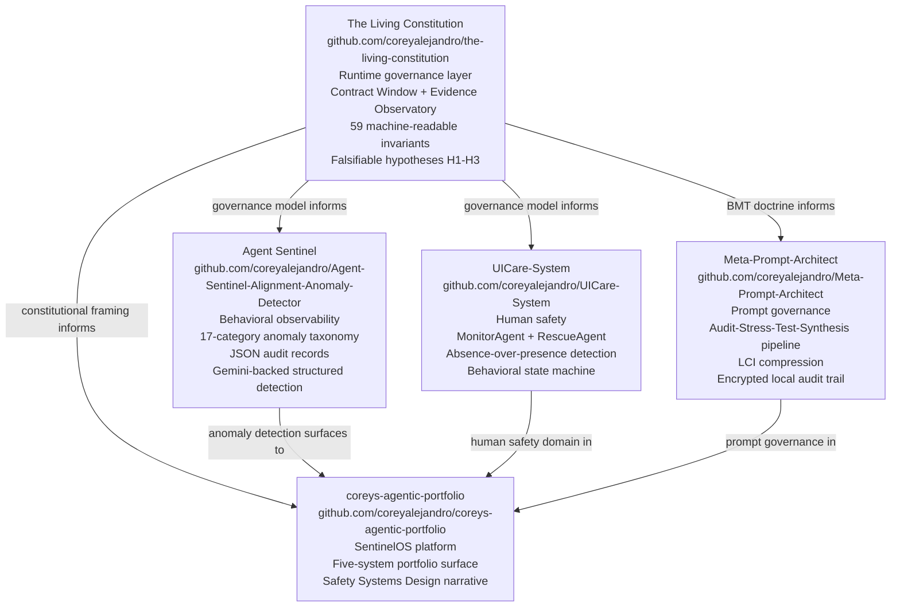
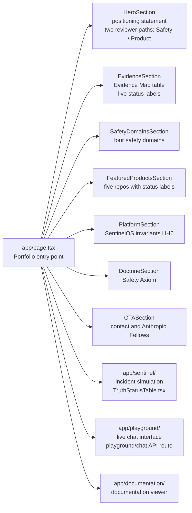

# Corey's Agentic Portfolio

**AI Safety Infrastructure Engineer | Creator of SentinelOS | Neurodivergent-First AI Builder**

A portfolio and product lab for **SentinelOS** — an AI Safety Operating Layer — and related work in governed AI systems, prompt architecture, instructional design, neurodivergent-first UX, and human-centered software.

This repository showcases my work at the intersection of:

- **AI Safety Infrastructure (SentinelOS)**
- **Prompt Engineering**
- **Instructional Systems / Learning Experience Design**
- **ML and AI Systems Engineering**
- **Full-Stack Product Development**
- **UI/UX Design**

My long-term focus is building **safer AI systems** and helping create the foundations for **neurodivergent-first AI**: models, interfaces, and workflows designed from the start to reduce ambiguity, support cognitive accessibility, and improve the quality of human-AI collaboration.

---

## Source of Truth

This portfolio's AI safety identity, platform architecture, and public messaging are governed by:

- `ai-safety-identity-strategy.md` — **SentinelOS AI Safety Identity Strategy (canonical reference)**

Any material changes to:

- SentinelOS platform identity
- the SentinelOS module list (PROACTIVE Gov, HUI Guard, Eval Workbench, Red Team Lab, Trace Console)
- the incident lifecycle or truth-status framing

must be reflected first in `ai-safety-identity-strategy.md` and then propagated into:

- this `README.md`
- application UX and copy
- SentinelOS documentation under `docs/`
- handoff and continuity files (`HANDOFF.md`, `openmemory.md`)

---

## What This Portfolio Is

This is not just a personal website.

It is a **working portfolio system** and **product lab** for:

- agentic AI interfaces
- prompt-centered product design
- governed AI workflows
- instructional AI systems
- neurodivergent-first interaction design
- production-grade portfolio storytelling

The goal is to make my work legible to both **humans** and **AI systems** by combining strong technical execution with explicit structure, documentation, and explainability.

---

## Safety Research Systems Map

Five safety research projects organized under a common governance layer. The Living Constitution provides the constitutional framework that governs the behavioral contracts, invariants, and evidence standards the other four systems inherit or reference.

**Reading this diagram without sight:** Five repositories are shown. The Living Constitution sits at the top and has directional relationships to all four others: it informs Agent Sentinel's governance model, informs UICare-System's governance model, informs Meta-Prompt-Architect through its BMT (Blind Man's Test) doctrine, and informs the portfolio's constitutional framing. Agent Sentinel surfaces to the portfolio as the anomaly detection component of the Safety Systems Design platform. UICare-System contributes the human safety domain to the portfolio. Meta-Prompt-Architect contributes prompt governance. The portfolio (coreys-agentic-portfolio) is the synthesis surface where all five systems are presented as a unified platform called SentinelOS.

---

## Featured Projects

- **Zero-Shot Prompt Composer** – Productized prompt-to-artifact system that converts user ideas into structured zero-shot, all-in-one prompt specifications.
- **Constitutional GitLab Agent** – AI governance layer for CI/CD that embeds constitutional checks and risk classification into merge workflows.
- **Zero-Shot OS (UPOS7VS Core)** – Deterministic multi-model orchestration and build operating system for governed AI workflows.
- **MADMall – Titan Data Engine** – Contextual bandit and rules engine for interpretable engagement signals in Graves' Disease teaching contexts.
- **HUI (formerly UICare)** – Behavioral risk mitigation PWA focused on fail-safe, reversible state transitions and behavioral safeguards.
- **Clarity AI** – Evaluation-driven fine-tuning platform using teacher-style rubrics and rubric-aligned training pipelines.

---

## Featured Thesis

I do not treat prompts as disposable text.

I treat them as **instructional architecture**.

My work turns ambiguous ideas into structured systems through:

- zero-shot prompt design
- all-in-one Prompt–PRD–Plan artifacts
- rubric-based reasoning
- deterministic build logic
- safety-oriented constraints
- reusable human-AI communication patterns

This portfolio includes work toward a user-facing system that helps people transform raw ideas into **zero-shot, all-in-one prompt artifacts**—structured prompts designed to make intent clearer, outputs stronger, and AI collaboration more reliable.

---

## Site Architecture

The portfolio is a Next.js App Router application. Each section below maps to a directory or page component in `app/`. Researchers can navigate the site section by section to see evidence for each domain claim.

**Reading this diagram without sight:** The entry point is app/page.tsx, which mounts seven sections in order: HeroSection (positioning statement with two reviewer paths for Safety and Product reviewers), EvidenceSection (a live Evidence Map table with status labels), SafetyDomainsSection (four safety domains), FeaturedProductsSection (five repositories with status labels), PlatformSection (SentinelOS invariants I1 through I6), DoctrineSection (the Safety Axiom), and CTASection (contact and Anthropic Fellows link). The entry point also routes to three sub-applications: app/sentinel/ for incident simulation with a TruthStatusTable component, app/playground/ for a live chat interface with a playground/chat API route, and app/documentation/ for a documentation viewer.

---

## Core Themes

### 1. Prompt Engineering as Systems Design

I build prompt frameworks, not one-off prompts. My strongest work treats prompting as a structured design discipline grounded in decomposition, sequencing, constraint logic, and output shaping.

### 2. Instructional Design for AI

As a former instructional leader and designer, I apply teaching logic to AI systems: scaffolding, rubric design, stepwise sequencing, clarity standards, and cognitive-load reduction.

### 3. AI Safety and Governance

My current and likely lifelong focus is **AI safety**. I am especially interested in constitutional AI, explicit evaluation criteria, auditable outputs, deterministic behavior, and governed human-AI workflows.

### 4. Neurodivergent-First Design

I believe AI should meet humans halfway—especially people whose cognition is rich, nonlinear, or poorly served by conventional interfaces. My work aims to reduce ambiguity and increase usability for neurodivergent thinkers.

### 5. End-to-End Product Thinking

I build across the stack: architecture, data logic, model workflows, interaction design, accessibility, documentation, and deployment.

---

## What You'll Find Here

This repository includes a combination of portfolio code, experiments, documentation, and structured project assets such as:

- `app/` — application routes and core portfolio experiences
- `components/` — reusable UI and interaction components
- `lib/` — supporting utilities and shared logic
- `docs/` — structured documentation and project context
- `tasks/` — implementation and planning artifacts
- `config/` — app and environment configuration
- `component-inventory/` — portfolio component cataloging
- `refactoring-package/` — refactor and system-improvement materials

Additional handoff and continuity files support maintainability and future iteration.

---

## Representative Project Directions

### Zero-Shot Prompt Systems

Systems that help convert vague human intent into structured, reusable, AI-ready prompt artifacts.

### Governed AI Workflows

Projects focused on constitutional constraints, evaluation-first design, verification, and trustworthy human-AI collaboration.

### Instructional AI

AI systems shaped by rubric logic, teaching strategy, accessibility, and explainable learning design.

### Neurodivergent-First Product Design

Interfaces and interaction patterns designed to lower ambiguity, reduce cognitive friction, and better support atypical thinking styles.

### Agentic Portfolio Experiences

Interactive portfolio components that demonstrate product thinking, design systems work, and AI-assisted user experiences.

---

## Why This Work Matters

Most AI products optimize for novelty, speed, or surface-level convenience.

My work is aimed at something deeper:

- making AI outputs more **truthful**
- making AI systems more **usable**
- making human intent more **translatable**
- making model behavior more **auditable**
- making interfaces more accessible for **neurodivergent users**
- making advanced systems safer for real human use

I am especially interested in building the scaffolding for the next generation of AI systems: systems that can be powerful without becoming opaque, and flexible without becoming ungovernable.

---

## Technical Orientation

This portfolio reflects my interdisciplinary background across:

- AI Engineering
- ML Engineering
- Data Science
- Full-Stack Web Development / SecDevOps
- Instructional Systems Design / LX Design
- UI/UX Design

I am strongest where these disciplines overlap.

---

## Current Direction

My present focus is centered on:

- **AI safety**
- **prompt architecture**
- **instructional design for AI**
- **neurodivergent-first product systems**
- **governed agentic workflows**
- **human-centered foundational AI thinking**

---

## Contact

**Corey Alejandro**
Portfolio: [coreyalejandro.com](https://coreyalejandro.com)
GitHub: [github.com/coreyalejandro](https://github.com/coreyalejandro)
LinkedIn: [linkedin.com/in/corey-alejandro](https://linkedin.com/in/corey-alejandro)

---

## Closing Note

I am building toward a future in which AI systems are not only more capable, but more understandable, more humane, and more usable by the people most often excluded by conventional design.

If you are interested in prompt architecture, AI safety, neurodivergent-first design, instructional AI, or governed agentic systems, this portfolio is a map of that work.
